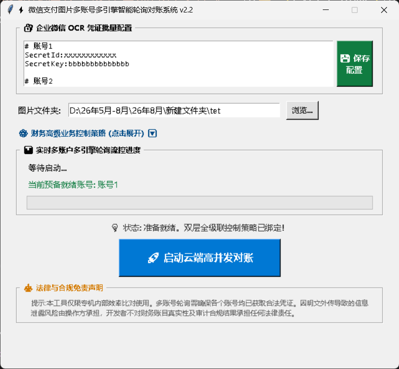

# 说明

- 自动识别微信账单图片，并安装要求放入到excel

- 支持多账号自动切换

- 技术加持，将微信每个账号的免费额度从1000增加到2000

<details>
<summary><h1>点击展开查看效果截图</h1></summary>

<br>



</details>

# 安装以及发布的一些命令

```bash

conda deactivate
conda env remove -n ocr-wx
conda create -n ocr-wx python=3.10 -y


pip install "tencentcloud-sdk-python-common[async]" tencentcloud-sdk-python-ocr

pip install -r requirements.txt


nuitka --standalone --msvc=latest --show-memory --show-progress --plugin-enable=tk-inter --windows-console-mode=disable main_win.py


signtool sign /fd sha256 /f "D:\tools\cert\t100.pfx" /tr http://timestamp.digicert.com /td sha256 /v "D:\source\pythonpath\ocr-wx\main_win.dist\main_win.exe"

```
